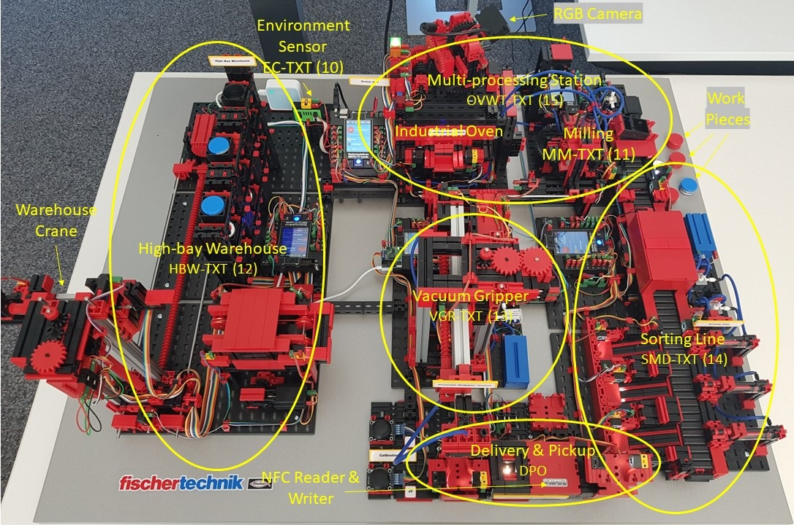

# Software System to Control a Fischertechnik Smart Factory Training Model (Industry 4.0), Version 9V

This repository contains the monolithic Python-based software system to control smart factory training models with hardware provided by Fischertechnik.
The control of the hardware relies on the fischertechnik TXT controllers acting as PLCs.

A scientific publication describing the internals of the software stack can be found [here](https://www.sciencedirect.com/science/article/pii/S0278612522000814):

Seiger, R., Malburg, L., Weber, B., & Bergmann, R. (2022). Integrating process management and event processing in smart factories: A systems architecture and use cases. Journal of Manufacturing systems, 63, 575-592.

## Instructions

### Setting up the System
To use this software, the TXT controllers of the factory need to be running the fischertechnik TXT [community firmware](https://cfw.ftcommunity.de/ftcommunity-TXT/en/).
The controllers need to be connected to the same IP-based network, either via Wifi or Ethernet.

The computer running this Python project has to be connected to the same network and it needs to be able to talk to all controllers via TCP.

The IP addresses of the TXT controllers follow the scheme: 192.168.0.xx with xx being passed as argument to the constructors
of the classes representing an individual station in the *txts* folder (e.g., HBW1.py, MM1.py). Below you can find a picture
with a sample configuration of controllers and their IP addresses.

External libraries used in the project are specified in the *requirements.txt* file. They can be installed via pip.

### Running the System

All TXT controllers need to be up and running the fischertechnik community firmware, have an active network connection, and run the *FTGui* app.
To start the project, you have to first run the Python file *init_factory.py* in folder *hardware*. Make sure that there are no errors
and all TXT controllers are connected successfully.

Second, you have to start the Python flask application *app.py* as python application. The system is now up and running.
You can find an OpenAPI/Swagger doc of the REST web services at:
http://127.0.0.1:5000/apidocs/
